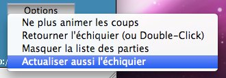
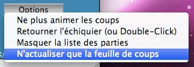

.. index:: improvments, parser, i18n, NAG
   pair: param; puzzlemode

Améliorations :
===============
Les améliorations portées vont de la correction de bugs mineurs, à l'internationalisation, la personnalisation graphique et de nouvelles options de visualisation.

Corrections de bugs 
--------------------
* Modification du parseur pour qu'il lise les pgn qui contiennent des tags de temps

  .. code-block:: bash
    
    35. Kh2 { [%clk 0:07.39] } Bb3 { [%clk 0:05.46] }
    
 Le parseur plantait si une ligne dans le bloc de coup commençait par '['.
 
 
* Affichage de commentaire avant le premier coup

 Si une partie contenait un commentaire au premier coup, ce dernier s'affichait sytématiquement au premier coup des autres parties, y compris si elle n'en avaient pas.

* Code non atteignable, imports inutiles, variables inutilisées.

Affichage du temps 
-------------------
 Le temps affiché est uniquement (pour l'instant) celui contenu dans les commentaires comme indiqué au dessus.

 Le tag est extrait du commentaire, et il est possible d'avoir du commentaire avant et ou après le tag.

 .. code-block:: bash
    
    35. Kh2 { texte avant [%clk 0:07.39] texte après } Bb3 { [%clk 0:05.46] }

Meilleure navigation
--------------------
* Un double-click pour retourner l'échiquier
 
* navigation via les flèches du clavier:
 
 Il vous faut ici remercier Jacques Bouthier Président de la `L.M.P.E.`_ . C'est lui qui m' a obligé à implémenter cette fontionalité !
 Il ne supporte pas d'avoir à effectuer le moindre click entre la liste des parties et l'activation des flèches :D
  
 * Flèche haut : partie précédente.
   
 * Flèche bas : partie suivante.
   
 * Flèche droite : coup suivant.
   
 * Flèche gauche : coup précédent.
   
 * Page haut : aller au premier coup.
   
 * Page bas : aller au dernier coup.

Internationalisation 
---------------------
 L'applet est complètement internationalisée : `traduction fr_FR`_

 * messages et libéllés des boutons.
 
 * coups sur la feuille de notation
 
 * les 139 `NAG`_ sont traduits
 
  .. code-block:: bash
 
    28. Kxf7 { un sacrifice qui met les noirs en dificulté } $1
    affichera :
    "!" bon coup un sacrifice qui met les noirs en dificulté

Skining 
--------
 L'applet d'origine ne permettait de modifier l'apparence que via 3 paramètres :

 .. code-block:: html
    
    <param name=lightSquares value="FFFBF1"> 
    <param name=darkSquares  value="4666A4"> 
    <param name=background   value="330066">
    
 Tout le reste, notamment les polices (nom, style, taille et couleur) était codé en dur !
 
 Les paramètres obligaient le webmaster à les spécifier sur toutes les pages.
 Ils ont été supprimés, et dorénavant tout est configurable dans le fichier `config.cfg`_

Nouveaux modes de visualisation
-------------------------------

* Le mode puzzlemode a été supprimé.

 .. code-block:: html
 
    <param name=puzzlemode value="off">

 il est remplacé par deux nouveaux modes :

 * mode problem
 
  il permet de présenter le pgn sans possibilité de navigation, et sans afficher la suite de coups. C'est utile pour présenter une position comme un problème à résoudre sans pour autant modifier le pgn initial.

  Il est inactif par défaut. Pour l'activer :
   .. code-block:: html
   
    <param name=problem value="on">

 * mode training
 
  il permet de découvrir les coups un par un sans afficher la suite, ou la totalité de la variante contrairement à l'ancien puzzlemode.
 
  Il est inactif par défaut. Pour l'activer :
   .. code-block:: html
   
    <param name=training value="on">

* Deux modes "Live"
 
 * un mode similaire à l'applet d'origine
 
  Il ne rafraîchit que la liste des coups. Il permet de naviguer dans la partie, durant l'actualisation des coups.
  Ce mode est idéal pour les parties à cadence longue.
  Le webmaster qui veut proposer ce comportement par défaut ajoutera donc le code suivant à la page html :
  
  .. code-block:: html
    
    <param name="refreshInterval" value=1> 
    <param name="refreshOnlySheetMoves"  value="on">
    
 * Un mode "Full Live"
  
  Ce dernier actualise automatiquement la position et le temps chaque fois qu'un coup est joué. Il est idéal pour les retransmissions de parties rapides. 
  
  Pour proposer ce comportement par défaut il suffit d'activer "RefreshIntervall" :
  
  .. code-block:: html
    
    <param name="refreshInterval" value=1> 
  
* Un option pour passer d'un mode à l'autre !
  
 Le comportement "Live" initial est choisi par le webmaster.
  
 |live|
 
 **Le bouton option permet à l'utilisateur de basculer d'un mode à l'autre quand il le désire.**
 |old_live|
  
  
.. _`config.cfg`: http://code.google.com/p/mcvim/source/browse/trunk/config.cfg
.. _`L.M.P.E.`: http://lmpe.org/
.. _`NAG`: http://fr.wikipedia.org/wiki/Portable_Game_Notation#NAG
.. _`traduction fr_FR`: http://code.google.com/p/mcvim/source/browse/trunk/i18n/MessagesBundle_fr_FR.properties

